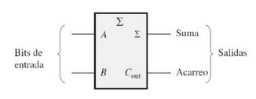
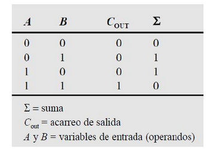

# Digital_Informe_2

# Lab 02 - Sumador-restador

Profesor Magistral: Diego Alexander Tibaduiza Burgos - Grupo: 3

Profesor Laboratorio: Johnny Germán Cubides Castro 

Estudiante: _**JUAN PABLO LOPEZ MARTINEZ**_

## Informe del laboratorio 

## 1. Marco teorico

* Logica combinacional: Los circuitos de lógica combinacional son un tipo de circuitos digitales que implementan operaciones de lógica Booleana, en los que la salida es función exclusivamente del valor de la entrada [1].

* Compuertas: Son circuitos electrónicos conformados internamente por transistores que se encuentran con arreglos especiales con los que otorgan señales de voltaje como resultado o una salida de forma booleana [2].
  
* Medio sumador: Recordemos  las  reglas  básicas  de  la  suma binaria:

0 + 0 = 0 

0 + 1 = 1 

1 + 0 = 1 

1 + 1 = 10 

Todas estas operaciones se realizan mediante un circuito lógico denominado medio sumador. El medio sumador admite dos dígitos binarios en sus entradas y genera dos dígitos binarios en  sus  salidas:  un  bit  de  suma  y  un  bit  de acarreo.  Los  semi-sumadores  se  representan mediante el siguiente símbolo lógico: 

La lógica del semi-sumador consiste en que, a partir de las expresiones correspondientes a la suma y al acarreo de salida se pueden obtener como funciones de las entradas. Se  anexa  la  tabla  de  verdad  para  ver  el funcionamiento de la lógica del semi-sumador.

  
* Sumador completo:

* Medio restador: Como su nombre indica, un binario Subtractor es un circuito de toma de decisiones que resta de dos números binarios de la otra, por ejemplo, X – Y para encontrar la diferencia resultante entre los dos números. El algoritmo de la resta en binario es el mismo que en el sistema decimal. Pero conviene repasar la operación de restar en decimal para comprender la operación binaria, que es más sencilla. Los términos que intervienen en la resta se llaman minuendo, sustraendo y diferencia.
Las restas básicas 0-0, 1-0 y 1-1 son evidentes:

· 0 – 0 = 0

· 1 – 0 = 1

· 1 – 1 = 0

· 0 – 1 = no cabe o se pide prestado al próximo.

* Restador completo: De igual manera, como para el proceso del sumador completo, si queremos restar para mas de 1 bit
    
  
## 2. Desarrollo de la practica

Sumador/Restador

## 2. Bibliografia
* [1]. Tomado de https://bookdown.org/alberto_brunete/intro_automatica/combinacionales.html
* [2]. Tomado de https://www.logicbus.com.mx/compuertas-logicas.php

