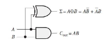
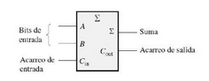
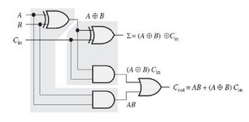
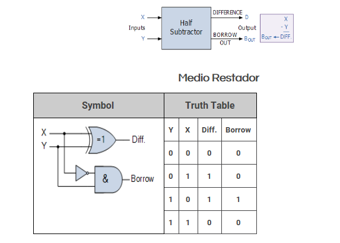
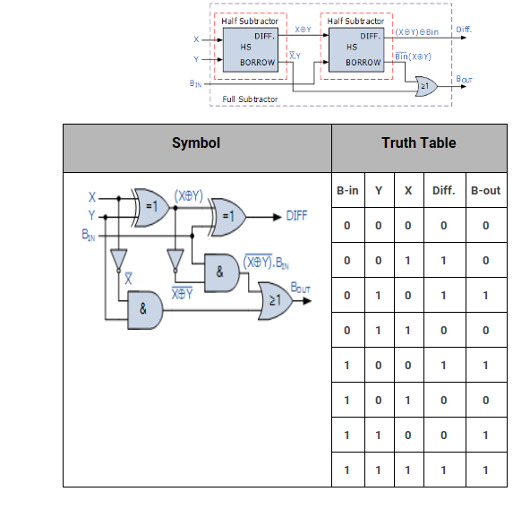
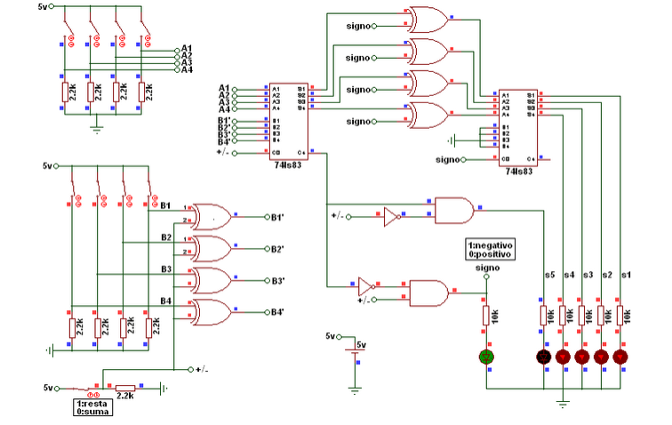

# Digital_Informe_2

# Lab 02 - Sumador-restador

Profesor Magistral: Diego Alexander Tibaduiza Burgos - Grupo: 3

Profesor Laboratorio: Johnny Germán Cubides Castro 

Estudiante: _**JUAN PABLO LOPEZ MARTINEZ**_

## Informe del laboratorio 

## 1. Marco teorico

* Logica combinacional: Los circuitos de lógica combinacional son un tipo de circuitos digitales que implementan operaciones de lógica Booleana, en los que la salida es función exclusivamente del valor de la entrada [1].

* Compuertas: Son circuitos electrónicos conformados internamente por transistores que se encuentran con arreglos especiales con los que otorgan señales de voltaje como resultado o una salida de forma booleana [2].
  
* Medio sumador: Recordemos  las  reglas  básicas  de  la  suma binaria:

0 + 0 = 0 

0 + 1 = 1 

1 + 0 = 1 

1 + 1 = 10 

Todas estas operaciones se realizan mediante un circuito lógico denominado medio sumador. El medio sumador admite dos dígitos binarios en sus entradas y genera dos dígitos binarios en  sus  salidas:  un  bit  de  suma  y  un  bit  de acarreo.  Los  semi-sumadores  se  representan mediante el siguiente símbolo lógico: 

La lógica del medio sumador consiste en que, a partir de las expresiones correspondientes a la suma y al acarreo de salida se pueden obtener como funciones de las entradas. Se  anexa  la  tabla  de  verdad  para  ver  el funcionamiento de la lógica del medio sumador.

Se  puede  observar  que  la  salida  de  acarreo (𝐶𝑜𝑢𝑡) es 1 sólo cuando A y B son 1; por tanto, 𝐶𝑜𝑢𝑡  puede  expresarse  como una  operación AND de las variables de entrada. 𝐶𝑜𝑢𝑡 =𝐴𝐵 También  se  puede  ver  que  la  salida correspondiente a la suma (Σ) es 1 sólo si las variables  A  y  B  son  distintas.  Por  tanto,  la suma  puede  expresarse  como  una  operación OR-exclusiva de las variables de entrada. 

Σ = 𝐴 ⊕ 𝐵

* Sumador completo: Un sumador acepta  dos bits de entrada y  un acarreo  de  entrada,  y  genera  una  salida  de suma  y  un  acarreo  de  salida.  La  diferencia principal  entre  un  sumador  completo  y  un medio sumador es  que  el  sumador  completo acepta  un  acarreo  de  entrada.  El  símbolo lógico de un sumador completo es el siguiente:

La  lógica del  sumador  completo  consiste  en sumar  dos  bits  de  entrada  y  un  acarreo  de entrada.  Del  medio sumador sabemos  que  la suma  de  los  bits  de  entrada  A  y  B  es  la operación OR-exclusiva de esas dos variables, A ⊕ B. Para sumar el acarreo de entrada (𝐶𝑖𝑛) a los bits de entrada, hay que aplicar de nuevo la  operación  OR-exclusiva,  obteniéndose  la siguiente ecuación para la salida de suma del sumador completo [3]: 

𝛴  =   (𝐴  ⊕  𝐵)  ⊕  𝐶𝑖𝑛 

Para  implementar  la  función  del  sumador completo  se  pueden  utilizar  dos  compuertas XOR  de  2  entradas.  La  primera  tiene  que generar el término A ⊕ B, y la segunda tiene como  entradas la salida  de la  primera puerta XOR y el acarreo de entrada. Esto se ilustra con la imagen siguiente: 

* Medio restador: Como su nombre indica, un binario Subtractor es un circuito de toma de decisiones que resta de dos números binarios de la otra, por ejemplo, X – Y para encontrar la diferencia resultante entre los dos números. El algoritmo de la resta en binario es el mismo que en el sistema decimal. Pero conviene repasar la operación de restar en decimal para comprender la operación binaria, que es más sencilla. Los términos que intervienen en la resta se llaman minuendo, sustraendo y diferencia.
Las restas básicas 0-0, 1-0 y 1-1 son evidentes [4].:

· 0 – 0 = 0

· 1 – 0 = 1

· 1 – 1 = 0

· 0 – 1 = no cabe o se pide prestado al próximo.

* Restador completo: De igual manera, como para el proceso del sumador completo, si queremos restar para mas de 1 bit.

## 2. Desarrollo de la practica

Dado que se tuvieron algunos problemas con la parte de simulacion en Digital, se hizo el siguiente esquematico en el software de Proteus y se simulo. 

Se muestra el circuito de un sumador/restador de dos números de 4 bits, que hará la suma o resta de dos números (A y B), y que mostrará el resultado en 6 leds, 5 led rojos que representaran la magnitud, y un led verde que representara el signo. Cuando el led verde este en "1" (prendido), indicará que el resultado es negativo, y cuando el led verde este en "0" (apagado), indicara que el resultado es positivo. Como entradas se tendrán los dos números A y B, y un interruptor que indicara la operación, cuando el interruptor este en "0" (abierto) la operación es suma, y cuando el interruptor este en "1" (cerrado), la operación es resta. Se hará uso principalmente de compuertas XOR y del sumador completo 74LS83. En este sumador restador se puede presentar 3 situaciones:

1. Se realiza la operación A+B. El máximo resultado será 30 y el mínimo resultado será 0. El resultado es positivo.
2. Se realiza la operación A-B, en donde A es mayor o igual que B. El resultado máximo es 15 y el resultado mínimo es 0.El resultado es positivo.
3. Se realiza la operación A-B, en donde A es menor que B. El resultado máximo es -1 y el resultado mínimo es -15. El resultado es negativo.

Para la realizacion de la practica, se utilizaron los siguientes componentes:

- 2 74LS83 (sumadores de 4 bits)
- 1 74XX08 (cada integrado tiene 4 compuertas and)
- 1 74XX04 (cada integrado tiene 6 compuerta not)
- 2 74XX86 (cada integrado contiene 4 compuertas xor)
- 9 resistencias de 2.2k ohmios
- 6 resistencias de 10k ohmios
- 5 leds rojos
- 1 led verde
- 2 dipswitch de 4 posiciones
- 1 dipswitch de 1 posición
- 1 fuente de 5 voltios

Segun el anterior circuito. Se muestra la resta A menos B. A tiene el valor de 0 y B tiene el valor de 15. La respuesta es -15.

## 3. Bibliografia
* [1]. Tomado de https://bookdown.org/alberto_brunete/intro_automatica/combinacionales.html
* [2]. Tomado de https://www.logicbus.com.mx/compuertas-logicas.php
* [3]. Tomado de https://www.studocu.com/es-mx/document/instituto-tecnologico-de-leon/electronica-digital/sumadores-y-restadores-digitales/3052105
* [4]. Tomado de https://compilandoconocimiento.com/2017/06/13/sumador-y-restador/

